# General Project Architecture

## Early Warning System for Parlichart

Parlichart's Early Warning system is a service designed to be
run every 15 minutes, it then scans a number of RSS feeds
belonging to well known Turkish news agencies, if it finds any
trigger words to be mentioned in the last 15 minutes in any
of those agencies, it creates a GitHub issue to the `parlichart/parlichart`
repo, with the specific tag `EWSfP`.

[EWSfP is deployed as a Google Cloud Run Job](https://github.com/parlichart/parlichart/blob/main/terraform/ewsfp.tf), which is triggered by a
Google Cloud Scheduler Job, it is set to trigger every fifteen minutes
via crontab `*/15 * * * *`.

To make the GCP Cloud Run Job work, EWSfP is deployed as a Docker image
to the [Github Container Registry](http://ghcr.io/parlichart/ewsfp), this
deployment is governed by a [GitHub action](https://github.com/parlichart/parlichart/blob/main/.github/workflows/ewsfp-deploy.yml)
that is triggered everytime the Dockerfile or the `packages/news/src` directory
is edited in a push.
